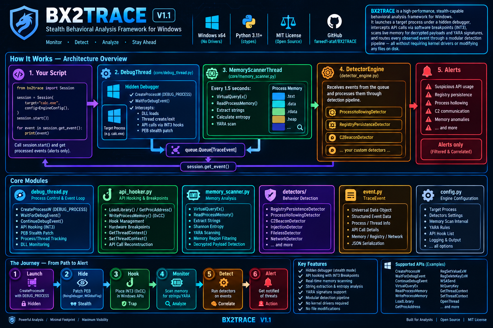

<div align="center">

# 🔬 BX2TRACE

### Stealth Behavioral Analysis Framework for Windows

*The surgical precision of a kernel debugger. The simplicity of Python.*

[](https://pypi.org/project/bx2trace/)
[](https://python.org)
[](https://github.com/fareed1-ataf/Bxtracer)
[](LICENSE)
[](https://github.com/fareed1-ataf/Bxtracer)

---




**`BX2TRACE` launches any Windows executable under a hidden debugger, intercepts every dangerous API call in real-time via `INT3` software breakpoints, scans live memory for decrypted payloads and YARA signatures — all from pure Python, with zero kernel drivers and zero disk writes.**

Built for malware analysts, threat hunters, and AI-powered security pipelines.

</div>

---

## 📋 Table of Contents

1. [Why BX2TRACE?](#-why-BX2TRACE)
2. [Architecture](#-architecture)
3. [Requirements & Installation](#-requirements--installation)
4. [Quick Start — 15 Lines](#-quick-start--15-lines)
5. [Usage Examples](#-usage-examples)
   - [Example 1 — Basic Malware Triage](#example-1--basic-malware-triage)
   - [Example 2 — Custom Detector (Hosts File Tampering)](#example-2--custom-detector-hosts-file-tampering)
   - [Example 3 — AI-Powered Event Analysis](#example-3--ai-powered-event-analysis-with-llm)
   - [Example 4 — Ransomware Detection Pipeline](#example-4--ransomware-detection-pipeline)
   - [Example 5 — Network C2 Beacon Detection](#example-5--network-c2-beacon-detection)
   - [Example 6 — Standalone Memory Forensics (No Debugger)](#example-6--standalone-memory-forensics-no-debugger)
   - [Example 7 — SIEM / Database Integration](#example-7--siem--database-logging-pipeline)
6. [AI Integration Guide](#-ai-integration-guide)
7. [Intercepted APIs — Full List](#-intercepted-apis--full-list)
8. [TraceEvent Reference](#-traceevent--the-universal-data-object)
9. [EngineConfig Reference](#-engineconfig--all-options)
10. [Built-in Detectors](#-built-in-detectors)
11. [Module Map](#-module-map)
12. [Comparison with Similar Tools](#-comparison-with-similar-tools)
13. [Known Limitations](#-known-limitations)
14. [Disclaimer](#-disclaimer)

---

## 🎯 Why BX2TRACE?

Most dynamic analysis tools require a VM, a kernel driver, or a complex setup. `BX2TRACE` is different:

| Problem | BX2TRACE Solution |
|---------|-------------------|
| Tools need kernel drivers | Pure user-mode, zero drivers |
| Malware detects sandboxes | PEB stealth patch hides the debugger |
| Events are unstructured logs | Every event is a typed `TraceEvent` dataclass |
| Hard to add custom detection | Drop-in `BaseDetector` plugin system |
| No AI-ready data format | JSON-serializable events, ready for LLM pipelines |
| Child processes escape | Auto-tracks every child spawned by the target |
| Memory decryption missed | Live periodic memory scanner with entropy + YARA |

---

## 🏗 Architecture

```
┌─────────────────────────────────────────────────────────────────────┐
│  Your Script / AI Agent / SIEM Connector                            │
│                                                                     │
│   config = EngineConfig(target_path="malware.exe")                  │
│   session = TraceSession(config)                                    │
│   session.engine.load_defaults()                                    │
│   session.start()                                                   │
│                              │                                      │
│          ┌───────────────────┴──────────────────┐                   │
│          ▼                                      ▼                   │
│  ┌───────────────────┐              ┌──────────────────────┐        │
│  │   DebugThread     │              │  MemoryScannerThread │        │
│  │                   │              │                      │        │
│  │  CreateProcess(   │              │  Every 1.5 seconds:  │        │
│  │   DEBUG_PROCESS)  │              │  VirtualQueryEx()    │        │
│  │                   │              │  ReadProcessMemory() │        │
│  │  WaitForDebugEvent│              │  extract_strings()   │        │
│  │  ──────────────── │              │  shannon_entropy()   │        │
│  │  INT3 breakpoints │              │  YARA scan           │        │
│  │  on 64 Win APIs   │              │  string diff()       │        │
│  │                   │              │                      │        │
│  └────────┬──────────┘              └──────────┬───────────┘        │
│           │                                    │                    │
│           └─────────────┬──────────────────────┘                    │
│                         ▼                                           │
│              queue.Queue[TraceEvent]                                 │
│                         │                                           │
│              session.get_event()                                    │
│                         │                                           │
│              DetectorEngine.process(event)                          │
│              ┌──────────┴─────────────────────────────┐             │
│              │ ProcessHollowingDetector                │             │
│              │ RegistryPersistenceDetector             │             │
│              │ C2BeaconDetector                        │             │
│              │ ... your custom detectors ...           │             │
│              │ ... your AI analyzer ...                │             │
│              └─────────────────────────────────────────┘             │
└─────────────────────────────────────────────────────────────────────┘
```

**Key design properties:**
- **Queue-decoupled** — producers and consumers are fully isolated; add consumers without touching producers
- **Crash-safe** — an exception inside one detector never kills the pipeline
- **Stealth-first** — `BeingDebugged` and `NtGlobalFlag` in the PEB are cleared immediately after launch
- **Child-aware** — every child process spawned by the target gets its own hook set automatically

---

## 💻 Requirements & Installation

| | Detail |
|---|---|
| **OS** | Windows 10 / 11 — **x64 only** |
| **Python** | 3.11 or newer |
| **Privileges** | **Administrator** (SeDebugPrivilege required) |
| **Dependencies** | `yara-python >= 4.5.0` |

```bash
pip install bx2trace
```

**From source (development mode):**
```bash
git clone https://github.com/fareed1-ataf/Bxtracer.git
cd Bxtracer/bx2trace
pip install -e .
```

**Verify:**
```python
import bx2trace
print(BX2TRACE.__version__)  # 1.1.0
```

> ⚠️ **Run as Administrator.** `ReadProcessMemory`, `WriteProcessMemory`, and `DEBUG_PROCESS` all require `SeDebugPrivilege`. The library raises `RuntimeError` immediately if this is not satisfied.

---

## ⚡ Quick Start — 15 Lines

```python
from bx2trace import TraceSession, EngineConfig, TraceMode

config = EngineConfig(
    target_path=r"C:\Samples\suspicious.exe",
    mode=TraceMode.FULL_TRACE,
    enable_stealth=True,
)

session = TraceSession(config)
session.engine.load_defaults()
session.start()

while session.is_alive:
    event = session.get_event()
    if event:
        print(f"[{event.severity.name}] {event.category}/{event.action} | PID {event.pid}")
        for alert in session.engine.process(event):
            print(f"  >>> ALERT: {alert.action} — {alert.payload.get('description', '')}")

session.stop()
session.join()
```

---

## 📚 Usage Examples

### Example 1 — Basic Malware Triage

Full analysis session with all built-in detectors, saving alerts to a JSON report:

```python
import json
import time
from bx2trace import TraceSession, EngineConfig, TraceMode, Severity

config = EngineConfig(
    target_path=r"C:\Samples\dropper.exe",
    mode=TraceMode.FULL_TRACE,
    enable_stealth=True,
    memory_scan_interval=1.5,
    yara_rules_path=r"C:\Rules\malware_index.yar",
    event_queue_maxsize=5000,
)

session = TraceSession(config)
session.engine.load_defaults()
session.start()

alerts_log = []

try:
    while session.is_alive:
        event = session.get_event()
        if event is None:
            continue

        alerts = session.engine.process(event)
        for alert in alerts:
            entry = {
                "time":     alert.timestamp,
                "severity": alert.severity.name,
                "action":   alert.action,
                "pid":      alert.pid,
                "details":  alert.payload,
            }
            alerts_log.append(entry)

            # Print critical alerts immediately
            if alert.severity == Severity.CRITICAL:
                print(f"[!!!] CRITICAL — {alert.action}")
                print(f"      {alert.payload.get('description', '')}")

except KeyboardInterrupt:
    pass
finally:
    session.stop()
    session.join()

# Save full report
with open("triage_report.json", "w") as f:
    json.dump(alerts_log, f, indent=2)

print(f"\nAnalysis complete. {len(alerts_log)} alerts saved to triage_report.json")
```

---

### Example 2 — Custom Detector (Hosts File Tampering)

Write your own detection rule in under 20 lines:

```python
from bx2trace import (
    TraceSession, EngineConfig, TraceMode,
    BaseDetector, TraceEvent, EventCategory, EventAction, Severity,
)

class HostsTamperingDetector(BaseDetector):
    """Detects any process attempting to modify the Windows hosts file."""
    name = "hosts_tampering"

    def handles(self, event: TraceEvent) -> bool:
        return (
            event.category == EventCategory.FILE
            and event.action == EventAction.OPENED
        )

    def process(self, event: TraceEvent) -> list[TraceEvent]:
        path = event.payload.get("details", {}).get("path", "").lower()
        if r"drivers\etc\hosts" in path:
            return [event.derive(
                source=self.name,
                action="HOSTS_FILE_ACCESS",
                severity=Severity.HIGH,
                payload={
                    "path": path,
                    "description": "Process accessed the Windows hosts file — "
                                   "possible DNS hijacking or C2 redirect.",
                },
            )]
        return []


config = EngineConfig(target_path=r"C:\Samples\suspicious.exe")
session = TraceSession(config)
session.engine.load_defaults().register(HostsTamperingDetector())

session.start()
while session.is_alive:
    event = session.get_event()
    if event:
        for alert in session.engine.process(event):
            print(f"[{alert.severity.name}] {alert.action} — {alert.source}")
session.join()
```

---

### Example 3 — AI-Powered Event Analysis with LLM

`BX2TRACE` is designed to be the **perception layer** under an AI agent. Every `TraceEvent` is JSON-serializable, making it trivial to feed events into any LLM for behavioral narration or threat scoring:

```python
import json
from openai import OpenAI
from bx2trace import TraceSession, EngineConfig, TraceMode, Severity

client = OpenAI()

SYSTEM_PROMPT = """
You are a malware analyst AI. You receive a batch of behavioral events captured from
a Windows process under a debugger. Each event is a JSON object with fields:
category, action, severity, pid, tid, payload.

Your job:
1. Narrate what the process is doing in plain English (2-3 sentences).
2. Give a threat score from 0 (benign) to 10 (confirmed malware).
3. List the top 3 IOCs (Indicators of Compromise) you observed.
4. Suggest the most likely malware family or attack technique (MITRE ATT&CK).

Be concise, precise, and technical.
"""

def analyze_with_ai(events_batch: list[dict]) -> str:
    """Send a batch of events to the LLM for behavioral analysis."""
    response = client.chat.completions.create(
        model="gpt-4o",
        messages=[
            {"role": "system", "content": SYSTEM_PROMPT},
            {"role": "user",   "content": json.dumps(events_batch, indent=2)},
        ],
    )
    return response.choices[0].message.content


config = EngineConfig(
    target_path=r"C:\Samples\ransomware_sample.exe",
    mode=TraceMode.FULL_TRACE,
    enable_stealth=True,
)

session = TraceSession(config)
session.engine.load_defaults()
session.start()

batch = []
BATCH_SIZE = 30  # Analyze every 30 events

while session.is_alive:
    event = session.get_event()
    if event is None:
        continue

    # Serialize the event for the AI
    batch.append({
        "category": event.category,
        "action":   event.action,
        "severity": event.severity.name,
        "pid":      event.pid,
        "payload":  event.payload,
    })

    if len(batch) >= BATCH_SIZE:
        print("\n--- AI Analysis ---")
        analysis = analyze_with_ai(batch)
        print(analysis)
        batch.clear()

session.join()
```

**Sample AI Output:**
```
Threat Score: 9/10

The process is performing a classic ransomware initialization sequence: it first
queries cryptographic API (CryptGenKey with AES-256), then enumerates files via
CreateFile handles, followed by WriteFile calls with high-entropy data — strong
indicators of in-place file encryption.

Top IOCs:
  1. CryptGenKey(AES-256) called within 2s of process start
  2. 47 WriteFile calls to .docx/.xlsx files in under 10 seconds
  3. RegSetValueEx to HKCU\Run — establishing persistence

MITRE ATT&CK: T1486 (Data Encrypted for Impact), T1547.001 (Registry Run Keys)
```

---

### Example 4 — Ransomware Detection Pipeline

Detect file encryption patterns in real-time using a custom detector:

```python
import time
from collections import defaultdict
from bx2trace import (
    TraceSession, EngineConfig, TraceMode,
    BaseDetector, TraceEvent, EventCategory, EventAction, Severity,
)

class RansomwareDetector(BaseDetector):
    """
    Detects mass file write operations combined with high-entropy memory,
    consistent with ransomware encryption behavior.
    MITRE ATT&CK: T1486 — Data Encrypted for Impact
    """
    name = "ransomware_detector"

    def __init__(self, write_threshold: int = 20, window_sec: float = 10.0):
        self.write_threshold = write_threshold
        self.window_sec = window_sec
        self._writes: dict[int, list[float]] = defaultdict(list)  # pid -> timestamps

    def handles(self, event: TraceEvent) -> bool:
        return (
            event.category == EventCategory.FILE
            and event.action == EventAction.WRITTEN
        )

    def process(self, event: TraceEvent) -> list[TraceEvent]:
        pid = event.pid
        now = event.timestamp

        # Keep only writes within the time window
        self._writes[pid] = [
            t for t in self._writes[pid] if now - t <= self.window_sec
        ]
        self._writes[pid].append(now)

        count = len(self._writes[pid])
        if count >= self.write_threshold:
            self._writes[pid].clear()  # Reset to avoid alert storm
            return [event.derive(
                source=self.name,
                action="RANSOMWARE_PATTERN_DETECTED",
                severity=Severity.CRITICAL,
                payload={
                    "pid":              pid,
                    "write_count":      count,
                    "window_sec":       self.window_sec,
                    "last_file":        event.payload.get("details", {}).get("path", ""),
                    "description":      f"Process PID {pid} wrote to {count} files in "
                                        f"{self.window_sec}s — ransomware encryption pattern.",
                },
            )]
        return []


config = EngineConfig(
    target_path=r"C:\Samples\locker.exe",
    mode=TraceMode.FULL_TRACE,
    enable_stealth=True,
    memory_scan_interval=1.0,
)

session = TraceSession(config)
session.engine.register(RansomwareDetector(write_threshold=20, window_sec=10.0))
session.start()

while session.is_alive:
    event = session.get_event()
    if event:
        for alert in session.engine.process(event):
            print(f"[!!!] {alert.action}")
            print(f"      {alert.payload['description']}")
            # Here you could: kill the process, snapshot the disk, notify SOC...
session.join()
```

---

### Example 5 — Network C2 Beacon Detection

Detect command-and-control beaconing (repeated connections to the same IP):

```python
from bx2trace import TraceSession, EngineConfig, TraceMode, C2BeaconDetector

config = EngineConfig(
    target_path=r"C:\Samples\agent.exe",
    mode=TraceMode.FULL_TRACE,
    enable_stealth=True,
)

session = TraceSession(config)

# Customize: alert if 3+ connections to the same IP:Port within 5 minutes
session.engine.register(
    C2BeaconDetector(window_sec=300.0, count_threshold=3)
)

session.start()

while session.is_alive:
    event = session.get_event()
    if event is None:
        continue

    # Print raw network events
    if event.category == "NETWORK":
        details = event.payload.get("details", {})
        print(f"[NET] {details.get('ip', '?')}:{details.get('port', '?')} "
              f"| domain={details.get('hostname', '')}")

    # Run detection
    for alert in session.engine.process(event):
        if alert.action == "C2_BEACON_DETECTED":
            ip    = alert.payload['target_ip']
            port  = alert.payload['target_port']
            count = alert.payload['connection_count']
            avg   = alert.payload['avg_interval_sec']
            print(f"\n[!!!] C2 BEACON — {ip}:{port}")
            print(f"      Connections: {count} | Avg interval: {avg:.1f}s")

session.join()
```

---

### Example 6 — Standalone Memory Forensics (No Debugger)

Use the memory reader utilities on any already-running process — no debugger session needed:

```python
from bx2trace import (
    open_process_for_dump,
    read_committed_regions,
    extract_strings,
    shannon_entropy,
    entropy_by_page,
    URL_PATTERN,
    IPV4_PATTERN,
    PAGE_EXECUTE_READWRITE,
)

# Open any running process by PID (requires Administrator)
handle = open_process_for_dump(pid=4821)

# Read all RWX memory regions (most suspicious — writable + executable)
regions = read_committed_regions(
    handle,
    protections_filter={PAGE_EXECUTE_READWRITE},
    max_region_size_mb=50,
)

for base_addr, data in regions:
    entropy = shannon_entropy(data)

    # Flag high-entropy regions (likely encrypted/packed)
    if entropy > 6.8:
        print(f"RWX Region @ 0x{base_addr:016X} | {len(data)//1024} KB | "
              f"Entropy: {entropy:.3f}")

        # Extract readable strings
        strings = extract_strings(data, min_length=8)
        print(f"  Strings found: {len(strings)}")

        # Find embedded URLs and IPs
        urls = URL_PATTERN.findall(data)
        ips  = IPV4_PATTERN.findall(data)
        if urls:
            print(f"  URLs: {[u.decode(errors='ignore') for u in urls[:5]]}")
        if ips:
            print(f"  IPs : {[ip.decode(errors='ignore') for ip in ips[:5]]}")

        # Per-page entropy map
        pages = entropy_by_page(data)
        hot   = [(off, e) for off, e in pages if e > 7.2]
        if hot:
            print(f"  High-entropy pages: {len(hot)} (likely shellcode)")
```

---

### Example 7 — SIEM / Database Logging Pipeline

Feed all events directly into a SQLite database (swap for any SIEM connector):

```python
import sqlite3
import json
from bx2trace import TraceSession, EngineConfig, TraceMode

# Setup DB
conn = sqlite3.connect("trace_events.db")
conn.execute("""
    CREATE TABLE IF NOT EXISTS events (
        event_id    TEXT PRIMARY KEY,
        timestamp   REAL,
        source      TEXT,
        category    TEXT,
        action      TEXT,
        severity    TEXT,
        pid         INTEGER,
        tid         INTEGER,
        payload     TEXT
    )
""")

config = EngineConfig(
    target_path=r"C:\Samples\suspicious.exe",
    mode=TraceMode.FULL_TRACE,
    enable_stealth=True,
)

session = TraceSession(config)
session.engine.load_defaults()
session.start()

while session.is_alive:
    event = session.get_event()
    if event is None:
        continue

    conn.execute(
        "INSERT OR IGNORE INTO events VALUES (?,?,?,?,?,?,?,?,?)",
        (
            event.event_id,
            event.timestamp,
            event.source,
            event.category,
            event.action,
            event.severity.name,
            event.pid,
            event.tid,
            json.dumps(event.payload),
        ),
    )
    conn.commit()

    # Also run detectors
    for alert in session.engine.process(event):
        print(f"[ALERT] {alert.action}")

session.join()
conn.close()
print("All events saved to trace_events.db")
```

---

## 🤖 AI Integration Guide

`BX2TRACE` is architected to be the **ground-truth sensor layer** beneath any AI security system. Here is how it fits into modern AI-driven security workflows:

### Architecture Pattern: BX2TRACE + LLM Agent

```
┌─────────────────────────────────────────────────┐
│              AI Security Agent                  │
│                                                 │
│  ┌─────────────┐      ┌──────────────────────┐  │
│  │   Planner   │◄────►│   LLM (GPT-4o etc.)  │  │
│  │  (LangChain │      │                      │  │
│  │   AutoGen   │      │  "Score this batch"  │  │
│  │   CrewAI)   │      │  "What MITRE tactic?"│  │
│  └──────┬──────┘      │  "Write IOC report"  │  │
│         │             └──────────────────────┘  │
│         ▼                                       │
│  ┌──────────────┐                               │
│  │   BX2TRACE   │  ← Ground truth sensor        │
│  │  TraceSession│    All events are real,        │
│  │              │    typed, and timestamped      │
│  └──────────────┘                               │
└─────────────────────────────────────────────────┘
```

### Why BX2TRACE is ideal for AI pipelines:

| Property | Benefit for AI |
|----------|---------------|
| **JSON-serializable events** | Feed directly to any LLM API without preprocessing |
| **Structured `TraceEvent` schema** | Consistent field names make prompts reliable |
| **Severity pre-labeled** | Use as training labels (`INFO`/`SUSPICIOUS`/`HIGH`/`CRITICAL`) |
| **Timestamps on every event** | Enable temporal reasoning and sequence analysis |
| **Unique `event_id` per event** | Perfect for RAG (Retrieval-Augmented Generation) vector stores |
| **Queue-based architecture** | Easy to add an AI consumer thread alongside other consumers |

### Example: AutoGen Multi-Agent Threat Analysis

```python
# Concept sketch — plug BX2TRACE into any multi-agent framework
import json
from bx2trace import TraceSession, EngineConfig, TraceMode

# BX2TRACE acts as the "tool" that agents call
def get_next_event_batch(session: TraceSession, batch_size: int = 50) -> list[dict]:
    """Tool callable by an AI agent to get the next batch of behavioral events."""
    events = []
    while len(events) < batch_size and session.is_alive:
        event = session.get_event()
        if event:
            events.append({
                "id":       event.event_id,
                "time":     event.timestamp,
                "category": event.category,
                "action":   event.action,
                "severity": event.severity.name,
                "pid":      event.pid,
                "payload":  event.payload,
            })
    return events


# AutoGen / LangChain tool registration (pseudocode)
# @tool
# def analyze_process(target_path: str) -> str:
#     session = TraceSession(EngineConfig(target_path=target_path, ...))
#     session.start()
#     batch = get_next_event_batch(session, 50)
#     return json.dumps(batch)   # AI agent receives real behavioral data
```

### Using BX2TRACE for AI Training Data

```python
# Collect labeled behavioral traces for model training
import json
from bx2trace import TraceSession, EngineConfig, TraceMode

SAMPLES = [
    (r"C:\Benign\notepad.exe",       "benign"),
    (r"C:\Malware\emotet_sample.exe", "banking_trojan"),
    (r"C:\Malware\wannacry.exe",      "ransomware"),
]

for exe_path, label in SAMPLES:
    config = EngineConfig(
        target_path=exe_path,
        mode=TraceMode.FULL_TRACE,
        enable_stealth=True,
    )
    session = TraceSession(config)
    session.engine.load_defaults()
    session.start()

    trace = []
    while session.is_alive:
        event = session.get_event()
        if event:
            trace.append({
                "category": event.category,
                "action":   event.action,
                "severity": event.severity.name,
                "payload":  event.payload,
            })
    session.join()

    # Save labeled trace for training
    with open(f"training_data/{label}_{exe_path.split('\\')[-1]}.json", "w") as f:
        json.dump({"label": label, "trace": trace}, f, indent=2)

    print(f"Saved {len(trace)} events for {label}")
```

---

## 🎣 Intercepted APIs — Full List

> All hooks are planted via `INT3` (software breakpoint) at the function entry point. Arguments are read from x64 calling convention registers (RCX, RDX, R8, R9) and the shadow space above RSP.

| Category | DLL | Functions |
|----------|-----|-----------|
| **Process Spawning** | kernel32, ntdll | `CreateProcessW/A`, `NtCreateUserProcess`, `LdrLoadDll` |
| **Script Execution** | shell32 | `ShellExecuteW/A`, `ShellExecuteExW` |
| **Network — Sockets** | ws2_32 | `connect`, `send`, `recv`, `WSASend`, `WSAConnect` |
| **Network — DNS** | ws2_32 | `getaddrinfo`, `GetAddrInfoW`, `gethostbyname` |
| **Network — HTTP** | wininet, winhttp | `InternetConnectW/A`, `WinHttpConnect`, `WinHttpOpenRequest`, `WinHttpSendRequest`, `WinHttpReadData`, `HttpOpenRequestW`, `HttpSendRequestW/A`, `InternetReadFile` |
| **Registry** | advapi32 | `RegSetValueExW/A`, `RegDeleteValueW`, `RegDeleteKeyExW` |
| **File System** | kernel32 | `CreateFileW/A`, `WriteFile`, `DeleteFileW/A`, `MoveFileExW` |
| **Code Injection** | kernel32 | `VirtualAllocEx`, `WriteProcessMemory`, `CreateRemoteThread`, `CreateRemoteThreadEx` |
| **Surveillance** | user32 | `SetWindowsHookExW`, `GetClipboardData`, `SetClipboardData` |
| **Anti-Debug** | kernel32 | `IsDebuggerPresent`, `CheckRemoteDebuggerPresent` |
| **File Download** | urlmon | `URLDownloadToFileW` |
| **Privilege Escalation** | advapi32 | `AdjustTokenPrivileges`, `DuplicateToken`, `DuplicateTokenEx`, `ImpersonateLoggedOnUser` |
| **Cryptography** | advapi32, bcrypt | `CryptEncrypt`, `CryptDecrypt`, `CryptGenKey`, `CryptImportKey`, `BCryptEncrypt`, `BCryptDecrypt` |
| **Services (Persistence)** | advapi32 | `OpenSCManagerW`, `CreateServiceW/A`, `StartServiceW/A`, `ChangeServiceConfigW` |
| **Named Pipes** | kernel32 | `CreateNamedPipeW`, `ConnectNamedPipe` |
| **COM Execution** | ole32 | `CoCreateInstance` |

---

## 📦 TraceEvent — The Universal Data Object

```python
@dataclass
class TraceEvent:
    source:         str       # "debug_loop" | "memory_scanner" | detector name
    category:       str       # EventCategory value
    action:         str       # EventAction value or free string
    pid:            int
    tid:            int
    severity:       Severity  # INFO | SUSPICIOUS | HIGH | CRITICAL
    payload:        dict      # Always JSON-serializable

    # Auto-populated
    event_id:       str       # UUID — unique across all events
    timestamp:      float     # Unix timestamp
    schema_version: int       # Always 1 in this version
```

**EventCategory values:**

| Value | Meaning |
|-------|---------|
| `PROCESS` | Process created or exited |
| `DLL` | DLL loaded or unloaded |
| `THREAD` | Thread created or exited |
| `MEMORY` | String found or RWX region detected |
| `YARA` | YARA rule matched in live memory |
| `REGISTRY` | Registry value written |
| `INJECTION` | Cross-process write or remote thread |
| `NETWORK` | Network connection |
| `FILE` | File operation |
| `CLIPBOARD` | Clipboard read or write |
| `EXCEPTION` | Unhandled exception in the target |
| `CRYPTO` | Cryptographic API called |
| `SECURITY` | Detector-generated alert |
| `OTHER` | Everything else |

---

## ⚙️ EngineConfig — All Options

```python
from bx2trace import EngineConfig, TraceMode

config = EngineConfig(
    # === Required ===
    target_path=r"C:\Samples\malware.exe",

    # === Launch Parameters ===
    mode=TraceMode.FULL_TRACE,    # FULL_TRACE | MONITOR_ONLY | MEMORY_DUMP
    cmd_args="",                  # Command-line arguments for the target
    create_new_console=True,
    enable_stealth=True,          # Patch PEB: clear BeingDebugged + NtGlobalFlag

    # === Event Settings ===
    event_queue_maxsize=2000,     # Events dropped (never block) when full
    max_tracked_processes=50,

    # === Memory Scanner ===
    memory_scan_interval=1.5,     # Seconds between full scans
    min_string_length=6,
    max_strings_per_event=50,
    max_pages_per_event=10,
    max_region_size_mb=100,
    entropy_alert_threshold=7.0,  # Shannon entropy (0.0–8.0) above which a page is flagged
    rwx_string_threshold=20,      # Strings in RWX memory to trigger HIGH alert

    # === YARA ===
    yara_rules_path=None,         # Path to .yar file or directory of .yar files

    # === Hardware Breakpoints (future) ===
    hw_breakpoints=[],
)
```

| `TraceMode` | What runs |
|-------------|-----------|
| `FULL_TRACE` | Debugger + API hooks + Memory scanner |
| `MONITOR_ONLY` | Debugger + API hooks only |
| `MEMORY_DUMP` | Memory scanner on already-running PID |

---

## 🛡 Built-in Detectors

### `ProcessHollowingDetector` — MITRE T1055
Correlates `WriteProcessMemory` + `CreateRemoteThread` targeting the **same PID** within a time window.
```python
from bx2trace import ProcessHollowingDetector
session.engine.register(ProcessHollowingDetector(window_sec=30.0))
```
Alert keys: `attacker_pid`, `target_key`, `wpm_count`, `detection_window_sec`

---

### `RegistryPersistenceDetector` — MITRE T1547.001
Intercepts registry writes and resolves full key paths via `NtQueryKey`. Fires on known auto-start locations (`Run`, `RunOnce`, `Services`, `Winlogon`, `AppInit_DLLs`).
```python
from bx2trace import RegistryPersistenceDetector
session.engine.register(RegistryPersistenceDetector())
```
Alert keys: `hkey`, `value_name`, `type`, `key_path`, `matched_path`

---

### `C2BeaconDetector` — MITRE T1071, T1571
Tracks repeated connections to the same `(IP, Port)` within a sliding window.
```python
from bx2trace import C2BeaconDetector
session.engine.register(C2BeaconDetector(window_sec=300.0, count_threshold=3))
```
Alert keys: `target_ip`, `target_port`, `connection_count`, `avg_interval_sec`

---

## 🗺 Module Map

```
BX2TRACE/
├── __init__.py                  Public API — all 38 exported symbols
│
├── core/
│   ├── models.py                TraceEvent, EngineConfig, BaseDetector, Severity, ...
│   ├── trace_session.py         Level-1 entry point (wires all components)
│   ├── debug_thread.py          Main debug loop — WaitForDebugEvent, INT3 hooks
│   ├── api_hooker.py            INT3 breakpoint plant/restore lifecycle
│   ├── memory_scanner.py        Background periodic scanner (strings, entropy, YARA)
│   ├── detector_engine.py       Routing + crash isolation for detector plugins
│   ├── process_launcher.py      CreateProcessW wrapper (checks x64/WOW64)
│   ├── win_structs.py           ctypes structure definitions (CONTEXT, DEBUG_EVENT, ...)
│   └── constants.py             All WinAPI numeric constants + 64 hooked APIs list
│
├── detectors/
│   ├── process_hollow_detector.py
│   ├── registry_persistence_detector.py
│   └── c2_beacon_detector.py
│
├── extractors/
│   ├── strings.py               extract_strings(), diff_new_strings(), URL_PATTERN, ...
│   └── entropy.py               shannon_entropy(), entropy_by_page()
│
└── memory/
    └── reader.py                open_process_for_dump(), read_committed_regions(), ...
```

---

## 📊 Comparison with Similar Tools

| Feature | **BX2TRACE** | Cuckoo Sandbox | x64dbg (manual) | Frida |
|---------|:---:|:---:|:---:|:---:|
| Pure Python, embeddable | ✅ | ✅ | ❌ | Partial |
| No VM required | ✅ | ❌ (VM) | ✅ | ✅ |
| Stealth / PEB patch | ✅ | Limited | Manual | ✅ |
| Live memory string diff | ✅ | ❌ | Manual | Manual |
| YARA on live memory | ✅ | ✅ | ❌ | Partial |
| Shannon entropy per page | ✅ | ❌ | ❌ | ❌ |
| Child process tracking | ✅ | ✅ | ❌ | ❌ |
| Custom detector plugins | ✅ | Limited | ❌ | Partial |
| **AI-ready JSON events** | ✅ | ❌ | ❌ | ❌ |
| No kernel drivers | ✅ | Optional | ❌ | ❌ |
| Direct Syscall detection | ❌ | ❌ | Manual | Partial |

---

## ⚠️ Known Limitations

1. **INT3 is detectable** — Malware checking its own code bytes can detect the `0xCC` patch. Mitigation planned for v2.0 via Hardware Breakpoints (DR0–DR3) and `PAGE_GUARD`.

2. **Direct Syscalls bypass hooks** — Malware using raw `syscall` assembly (e.g., SysWhispers) never passes through `kernel32`/`ntdll`, so API hooks are blind to it. ETW or a kernel driver is required for full coverage.

3. **Memory scanner latency** — Scanner runs on a configurable interval (default: 1.5s). Sub-second in-memory operations may not be captured.

4. **64-bit only** — WOW64 (32-bit targets on 64-bit Windows) has limited support due to differing CPU context layout.

5. **User-mode only** — Kernel-mode rootkits operating below the Windows API surface are invisible to this library.

---

## ⚖️ Disclaimer

`BX2TRACE` is intended **strictly for educational and research purposes**. Use it only on systems you own or have **explicit written permission** to analyze. The authors assume no liability for misuse.

---

<div align="center">

**Built for security engineers who demand precision, stealth, and extensibility.**

*BX2TRACE v1.1.0 — © FBX2 — MIT License*

[](https://github.com/fareed1-ataf/Bxtracer)

</div>---


## 📖 What is BX2TRACE and Why Use It?

**BX2TRACE** is a powerful, pure-Python behavioral analysis and dynamic tracing framework designed specifically for Windows environments. It allows security analysts, threat hunters, and automated systems to monitor, intercept, and analyze malware execution in real-time without the heavy footprint of a virtual machine or a kernel-mode driver.

**Why use BX2TRACE?**
Traditional analysis tools are either easily detected by malware (like standard sandboxes) or require complex setups (like kernel drivers). **BX2TRACE** solves this by operating entirely in user-mode using surgical software breakpoints (INT3) and live memory scanning. It proactively hides itself from the target process by patching the Process Environment Block (PEB), making it incredibly stealthy. It is the perfect engine for building AI-powered analysis tools, custom SIEM pipelines, or standalone triage scripts.


